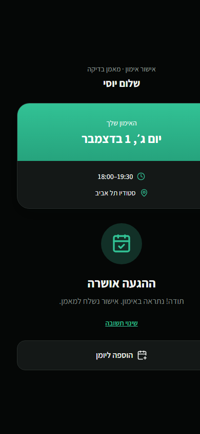

# Playwright calendar integration report

Date: 2026-09-07  
Viewport: 390 × 844 (mobile)

## Result

PASS — confirmed session data flowed from Lakebase Postgres through the NestJS public API into the production web artifact. The Add to Calendar action generated a valid iCalendar download.

## Verified

- `GET /api/public/confirm/:token` returned HTTP 200.
- The same public flow passed after clearing every browser cookie; `/api/auth/me`
  correctly returned HTTP 401 while the public confirmation endpoint remained usable.
- The Hebrew RTL page rendered the real coach, client first name, date, time, duration, and location.
- A confirmed session displayed `הוספה ליומן`.
- Declining the session persisted through the API and removed the calendar action.
- Reconfirming persisted through the API and restored the calendar action.
- Clicking the action downloaded `session-2026-12-01.ics`.
- The downloaded event contained a stable UID, UTC generation timestamp, 18:00–19:30 local event time, Hebrew title, location, and RFC 5545 CRLF line endings.

## Google Calendar compatibility

The app does not call a Google Calendar API or OAuth integration. It produces a
standard `.ics` file, which Google Calendar officially supports importing on a
computer: <https://support.google.com/calendar/answer/37118>. The
browser-generated file is included beside this report.

## Environment finding

The service already occupying port 3000 was not this repository's API and allowed only `http://localhost:5173`; testing the artifact from port 5175 was therefore blocked by CORS. The passing integration run used an isolated API on port 3001 and production web artifact on port 5176.

The anonymous run logs the expected `/api/auth/me` HTTP 401 as a browser resource
error because the root authentication provider probes for an optional session.
The public confirmation request itself succeeds with HTTP 200.
